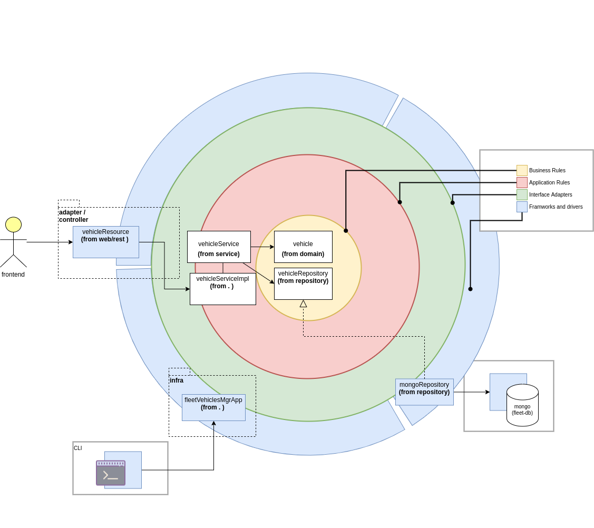
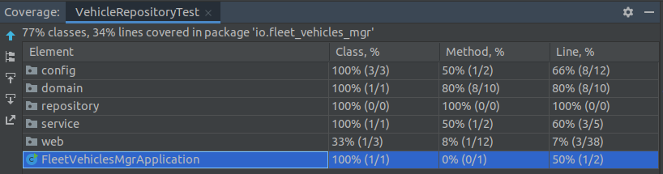

io-fleet-vehicles-manager
--------------------------------
implementation of vehicle-management-api for a vehicle fleet
Made with j17.

The component handles the following set of (crud) operations:

1. vehicle creation.
2. updating
3. vehicle selection

## Technical and architecture decisions
Source code follows an approximation of the Onion Architecture ideas, 
but with a reduced layout of directories according simplicity of the exercise.


## Instructions
Below (prerrequisites) are the instructions on how to build and run the project;

### Prerequisites

* openjdk-17 (java target vm, and configuration of system and path)
* gradle (build system)
* docker (containerized image)
* docker-compose (containerized image set): tool for defining and running multi-container Docker applications
* mongo compass (db manager) optional, (& to connect to mongo)
* idea optional, for dev purposes (ide: [idea toolbox](https://www.jetbrains.com/toolbox-app/)
  & intelli-j idea community)

### Build

`gradle build`

### Run (using development mode)
* run database
```
cd src/main/docker
docker-compose -f mongodb.yml up -d
cd ../../..
```
* run application
run the following command
```
gradle bootRun
```
* watch the published api at:
```
http://localhost:8080/swagger-ui/index.html
```


### Run (using production mode)
* run application (production mode)
  change it to the distribution folder
  and then run the program, using the following commands:
```
cd app/build/libs
java -jar <uberjar>.jar
cd ../../..
```

### Run (Using Test mode)

to run the unit test:
gradle test --tests io.web.rest.HelloControllerTest
gradle test --tests io.web.rest.VehicleResourceIT


### Stop (Database)
```
docker-compose -f src/main/docker/mongodb.yml stop
```

### With Docker (Build & Run)
* build the application container
```
docker build -t fleet-app .
```
* run with dependencies
```
cd src/main/docker
docker-compose -f app.yml up -d
cd ../../..
```

## Additional Notes

### **NOTE1**: questions

* should it be works in a reactive way?: could be reactive
* should support odata protocol?
* should i use mongo embedded? 
> what does matter is implmentation and used aproach to solve exercise and its completness
* what else nfr should i have to take in mind
* architecure style?


### **NOTE2**: Frameworks/Libraries used
- lombok is used to hide accessors/modifiers stuff in entities
- logback,slf4j: for logging purposes
- jackson: for json format file parsing
- springfox: for swagger management

### **NOTE3**: Directory Layout

| directory   | description
|-------------|------------------------------|
| /domain     | model & data entities        |
| /repository | ports to access              |
| /service    | service tier                 |
| /web/rest   | for external interaction     |


### **NOTE4**: backlog

- [x] Project scaffold
- [x] Testing for repositories -> Unittest
- [ ] Testing for resources -> Unittest
- [ ] Testing external -> Postman collection
- [x] Enable Cors
- [x] Development baseline
- [x] Swagger definition export
- [x] XML compatibility
- [ ] Additional properties mgmt
- [x] Containerize solution (naive)
- [ ] Containerize solution (using gradle jlib)
- [ ] Auth
- [ ] Coverage

### **NOTE5**: scaffold

* [spring initializer](https://start.spring.io/) used to do the scaffold of the project, with the following 
parameters:
- group: io
- artifact: fleet_vehicles_mgr
- target-jdk: j17
dependencies: 
- spring web ()
- spring data mongodb (data access)
- embedded mongo (for testing)
- lombok (for getter setter stuff because target is java)

* additional dependencies:

2 dependencias
- springfox
-@EnableSwagger2

* then change the base dir & import to ide


### **NOTE6** coverage report


### **NOTE7** references
* [scaffold](https://www.youtube.com/watch?v=OtBukxJy4kg)
* [reactive mono/flux](https://www.youtube.com/watch?v=3J_X1srMk3s)
* [mockito tests](https://www.youtube.com/watch?v=N8fQC89IhZA)
* [rest assured tests](https://www.youtube.com/watch?v=zEkI8xi3Mjs)

### **NOTE8** limitations
* swagger-ui does not add `Content-Type` header to requests
 > should be added manually on invocations, for instance:
```
curl -X GET "http://localhost:8080/vehicles" -H "Accept: application/json" -H "Content-Type: application/json"
```